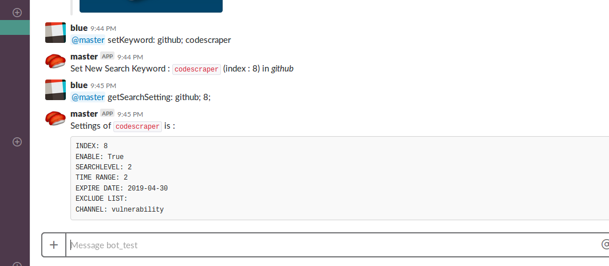
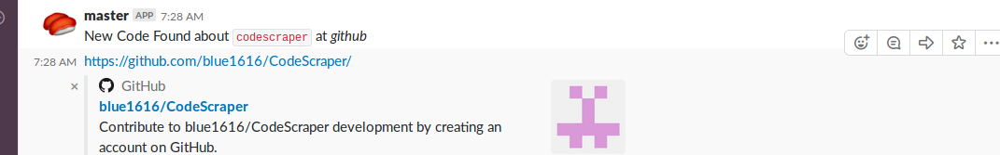

# CodeScraper

## Description
CodeScraper is Slackbot that searches sites such as Github, Gitlab, Pastebin with pre-registered keywords and notifies you when it finds new ones.

Currently the following functions are implemented.

|Function|Description|Notes|
|---|---|---|
|github|Search Github and find new repositories||
|gist|Search Github and find new Gist||
|github_code|Do Github code search<br>it depends on Github Index|Github API Token is required|
|gitlab|Search Gitlab and find new projects||
|gitlab_snippet|Scraping new posts of Gitlab Snippets|Regular Expression is available.|
|google_custom|Search with Google Custom Search and find web pages|Make Search Engine and set your Engine ID and API Token.<br>Free Google API has limit of 100 requests per day|
|pastebin|Scraping Pastebin with Scraping API|Pastebin PRO Account(Paid Account) is required.<br>Regular Expression is available|
|rss_feed|Get RSS Feed<br>Feed filtering by specific words is available||
|twitter|Search Twitter and find new tweets|||

## Requirements
It is supposed to run using Docker

Otherwise you need MongoDB and Python 3 and the following libraries
 - slackbot (https://github.com/lins05/slackbot)
 - lxml
 - crontab
 - feedparser
 - python-dateutil
 - pymongo
 - pyquery

## Install
Using Docker

```sh
docker-compose build
```

Without using Docker

```sh
pip3 install -r requirements
```

## Usage
### Run CodeScrapter
You need slackbot_settings.py.
Create your setting file.

```sh
mv ./master/slackbot_settings.py.sample ./master/slackbot_settings.py
vim ./master/slackbot_settings.py
```

Edit your config file
- Required settings
  - API_TOKEN (Line 6)
    - Log in Slack and access [here](https://my.slack.com/services/new/bot). Create your Slackbot.
    - Set your Slackbot API Token
  - channels(Line 17-19)
    - Set slack channels that your slackbot join
    - At least one channel must be listed
  - Enable Targets(Line 87-94)
    - Select whether to enable each search target(True|False)
    - Separate settings are required to activate the following targets
      - github_code : github_access_token must be set
      - pastebin : Pastebin PRO account(Paid Account) and Static IP is required. You have to set your static IP to whitelist for using scraping API
      - google_custom : google_custom_api_key and google_custom_search_engine_id must be set
  - default_channel
    - Channel that notifies search results of each target
    - It is possible to change for each search keyword
    - If string not listing in 'channels' is set, the first channel of 'channels' is specified.

- Optional settings
  - github_access_token(Line 78)
    - It requires if github_code is enabled
    - Get from [here](https://github.com/settings/tokens)
  - google_custom_api_key(Line 83)
    - It requires if google_custom is enabled
    - Get from [here](https://console.developers.google.com/)
  - google_custom_search_engine_id
    - It requires if google_custom is enabled
    - Get from [here](https://console.developers.google.com/)
  - Interval(Line 97-106)
    - Set search execution time for each search target
    - Set in crontab format
  - default_settings(Line 23-74)
    - Default settings of earh target
    - The contents of each item are as shown in the table below

|item|Description|
|---|---|
|Enable|Set whether a keyword is enable or not(True&#124;False)|
|SearchLevel|Set search range in github or github_code(1&#124;2). Search level 2 searchs for wider range than 1|
|Time_Range|Set Search Time Range in github or gist. Items created before the set number of days are searched|
|Expire_date|Set keyword expiration date. The expiration date will be after the number of days set here, from the date at the time of registration. The keywords that have expired will be invalidated|
|Exclude_list|Notice exclusion list. This setting is unnecessary as scripts automatically rewrites.|
|Channel|Set up the channel to be notified|

Run with docker-compose.

```sh
docker-compose up -d
```

After successful launch, Slcak will receive the following notification
> ---CodeScraper Slackbot Started---
>
> github : SUCCESS : Started <br>
> gist : SUCCESS : Started <br>
> gitlab : SUCCESS : Started <br>

### CodeScraper Commands
Search keywords are operated by commands via Slackbot

First, following command displays help

```
@{Slackbot name} help:
```

```
Command Format is Following:
	{Command}: {target}; {arg1}; {arg2}; ...

Command List:

'setKeyword: target; [word]'	Add [word] as New Search Keyword with Default Settings.
 (abbreviation=setK:)
'removeKeyword: target; [index]'tRemove the Search Keyword indicated by [index].
 (abbreviation=removeK:)
'enableKeyword: target; [index]'	Enable the Search Keyword indicated by [index].
 (abbreviation=enableK:)
'disableKeyword: target; [index]'	Disable the Search Keyword indicated by [index].
 (abbreviation=disableK:)
'setSearchLevel: target; [index]'	Set Search Level of Github Search (1:easily 2:) indicated by [index]. It is used in github and github_code.
 (abbreviation=setSL:)
'setExpireDate: target; [index]; [expiration date]'	Set a Expiration Date of the Keyword indicated by [index]. [expiration date] Format is YYYY-mm-dd.
 (abbreviation=setED:)
'setChannel: target; [index];[channel]'	Set channel to notify the Search Keyword's result.
 (abbreviation=setC:)
'getKeyword: target;'	Listing Enabled Search Keywords.
 (abbreviation=getK:)
'getAllKeyword: target;'	Listing All Search Keyword (include Disabled Keywords).
 (abbreviation=getAllK:)
'getSearchSetting: target; [index]'	Show Setting of the Search Keyword indicated by [index].
 (abbreviation=getSS:)

'reMatchTest: target; [index]; [text]'	Check wheaer the pattern indicated by [index] in [target] matches [text]. If set pattern to Pastebin ID, check the contens of pastebin.
'setFeed: [name]; [url]'	Add RSS Feed to [url] as [name].
 (abbreviation=setF:)
'setFeedFilter: [name]; [filter]'	Add new RSS Feed Filter. Notily only contains filter words.
 (abbreviation=setFF:)
'editFeedFilter: [name]; [index]; filter'	Edit Feed Filter indicated by [index] in RSS Feed of [name].
 (abbreviation=editFF:)
'removeFeedFilter: [name]; [index];'	Remove Feed Filter indicated by [index] in RSS Feed of [name].
 (abbreviation=removeFF:)
'setTwitterQuery: [query]; ([users];)'	Set [query] with Default Settings. If set [users], notify only from these users.
 (abbreviation=setTQ:)
'editTwitterQuery: [index]; [query]; ([users];)'	Edit Twitter Query indicated by [index].
 (abbreviation=editTQ:)
'addUserTwitterQuery: [index]; [users];'	Add User to Twitter Query indicated by [index]. That query notify only from these users.
 (abbreviation=addUserTQ:)
'removeTwitterQuery: [index];'	Remove Twitter Query indicated by [index].
 (abbreviation=removeTQ:)

'help:'	Show this Message.

Target:
	github
	gist
	github_code
	gitlab
	gitlab_snippet (Use RE match)
	google_custom
	pastebin (Use RE match)
	rss_feed
	twitter
```

Register Keywords to send commands to Slackbot.

Commands are below.
See 'help:' command for specific usage.

|Command|Description|Search targets|
|---|---|---|
|setKeyword:|Register new search keyword|github, gist, github_code, gitlab, gitlab_snippet, google_custom, pastebin|
|removeKeyword:|Remove specified search keyword|github, gist, github_code, gitlab, gitlab_snippet, google_custom, pastebin, twitter|
|enableKeyword:|Enable specified search keyword|all|
|disableKeyword:|Disable specified search keyword|all|
|setSearchLevel:|Set Search Range of specified search keyword|github, github_code|
|setExpireDate:|Set expiration date of specified search keyword|github, gist, github_code, gitlab, gitlab_snippet, google_custom, pastebin|
|setChannel:|Set channel to notify of specified search keyword|all|
|getKeyword:|Display lists of Enabled Keywords|all|
|getAllKeyword:|Display lists of all registered keyword|all|
|getSearchSetting:|Display current settings of specified search keyword|all|
|setFeed:|Set new feed to rss_feed|-|
|setFeedFilter:|Set new Feed Filter|-|
|editFeedFilter:|Edit specified Feed Fileter|-|
|removeFeedFilter:|Remove specified Feed Fileter|-|
|setTwitterQuery:|Set new twitter search query|-|
|editTwitterQuery:|Edit specified twitter search query|-|
|addUserTwitterQuery:|Add user criteria to specified twitter search query|-|
|removeTwitterQuery:|Remove specified twitter search query|-|
|help:|Display help|-|

The index is assigned to each search keywords. To change the setting, specify the index.
The index of each keyword can be known by keyword registration or by 'getKeyword:' command.



Notification on finding Github new repository



### Notices
- Pastebin
  - Pastebin PRO Account（Paid Account） is required.
  - Access [here](https://pastebin.com/doc_scraping_api) and set your static IP you run CodeScraper to whitelist
  - Static IP is required.
- Pastebin, Gitlab Snippet
  - Search keywords containing symbols as regular expressions(e.g. `[a-z1-7]{16}\.onion`, `example.com`). These searches are case sensitive
  - keywords with no symbols are not case sensitive.
  - Long regular expressions and patterns that take time to process can put a load on the CPU. It is recommended to refrain from it.
- Google Custom Search
  - Free Google API has limit of 100 requests per day
  - If you set search interval to every 2 hour, you can register at most 8 search keywords (12 * 8 = 96 reqs). Be aware that there is a limit on the number of keywords depending on the frequency of search

## Author
[blueblue](https://twitter.com/piedpiper1616)
